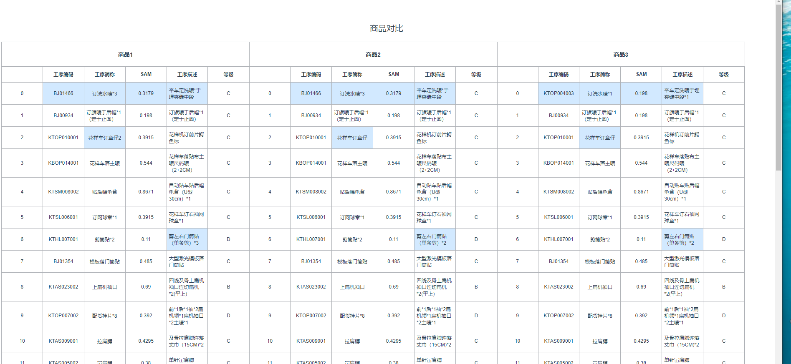

### 功能
商品对比功能，简单的数据对比
不同部分高亮标记


#  基于vue-cli创建的工程 vue脚手架

## 安装依赖
```
 基于vue-cli创建的工程 vue脚手架 可以自定义配置vue.config.js
 此工程带有一个vuex 添加购物车实例
 vue-cli + vue-router + vux + less
```

## 安装依赖
```
yarn install & npm install
```

### 开发模式
```
yarn run dev & npm run dev
```

### 打包
```
yarn run build & npm run build
```

###  测试
```
yarn run test & npm run test
```

### 检测
```
yarn run lint & npm run lint
```

### 更多配置
See [Configuration Reference](https://cli.vuejs.org/config/).

###  基本效果如下图


